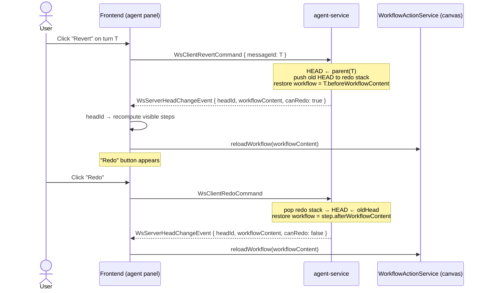
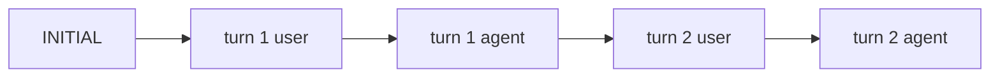

# [RFC] Revert & Redo for AI Agent turns (rewind the workflow to before an agent edit)

> **Status:** Draft — seeking feedback
> **Area:** AI Agent (copilot) · `agent-service` · frontend workspace
> **Type:** Feature proposal

## Summary

The Texera AI agent edits the user's **live workflow canvas** — its tools add, modify, and
delete operators (and the changes auto-persist). Today there is no agent-aware way to back out
a turn that went wrong: you fix it by hand. This proposal adds a **per-turn "Revert"** control
(rewind the workflow to the state *before* an agent turn) and a **"Redo"** control (undo the
revert), implemented almost entirely on top of machinery the agent already has.

I have a working prototype (tests passing, running locally) and would like feedback on the
design — especially the UX granularity and the protocol additions — before opening a PR.

## Motivation

- The agent mutates real state. A bad suggestion ("restructure this", a wrong delete) currently
  leaves the user to manually undo a multi-operator change.
- This raises the cost of *letting the agent try things*, which is exactly the behavior we want
  to encourage. A cheap, reliable "step back" makes the agent feel safe to experiment with.
- A frontend-only "visually undo" is **not** enough: the agent-service keeps its own notion of
  the current workflow (its HEAD), so the next message would silently clobber a cosmetic revert.
  We want a **true rewind** that keeps the agent's context consistent.

## Background — what already exists

The agent-service already models a conversation as a **version tree of ReAct steps**:

- Each `ReActStep` has an `id` and a `parentId` (the tree), plus `beforeWorkflowContent` and
  `afterWorkflowContent` snapshots.
- A **`HEAD`** pointer marks the current step; the visible chat is the ancestor path from root
  to `HEAD`.
- The frontend is already HEAD-aware: it recomputes the visible steps from `HEAD` and applies any
  workflow snapshot to the canvas via `WorkflowActionService.reloadWorkflow(...)`.

The **only missing primitive** was the ability to move `HEAD` *backward*. There was no client
command for it. That is the gap this proposal fills.

## Proposal

### Revert (per turn)
A **Revert** control on each agent turn. Clicking it:
1. Asks the agent-service to move `HEAD` to that turn's **parent** step.
2. The agent-service restores its working workflow to the turn's `beforeWorkflowContent` and
   replies with the new HEAD + workflow content.
3. The frontend advances its HEAD pointer (which recomputes the visible chat) and reloads the
   canvas from the snapshot.

### Redo
A single **Redo** control in the chat toolbar, shown only when a redo is available. The
agent-service keeps a **redo stack**: a revert pushes the pre-revert HEAD; redo pops it and moves
HEAD forward, restoring that step's `afterWorkflowContent`. Sending a **new prompt clears the
redo stack** (a new branch invalidates redo — standard undo/redo semantics). Redo is repeatable
for multiple consecutive reverts.

## How it works

### Revert + Redo flow

### HEAD movement over the step tree

`Revert(turn 2)` moves `HEAD` from `A2` to `A1` (turn 2's parent). The turn-2 steps stay in the
tree, so `Redo` can move `HEAD` back to `A2`. A new prompt after a revert branches from `A1` and
clears the redo stack.

## Components touched

| Layer | File | Change |
|---|---|---|
| Protocol | `agent-service/src/types/ws/client.ts` | `WsClientRevertCommand(messageId)`, `WsClientRedoCommand` |
| Protocol | `agent-service/src/types/ws/server.ts` | `WsServerHeadChangeEvent(headId, workflowContent, canRedo)`; `canRedo` on `WsServerSnapshotEvent` |
| Agent core | `agent-service/src/agent/texera-agent.ts` | `revertToTurnStart(messageId)`, `redo()`, `canRedo()`, a redo stack; cleared on new prompt / clear-history |
| Server | `agent-service/src/server.ts` | handle the two commands (reject while `GENERATING`); emit `canRedo` |
| FE service | `frontend/.../service/agent/agent.service.ts` | `revertTurn()`, `redo()`, `WsServerHeadChangeEvent` handler, `canRedo` observable |
| FE UI | `frontend/.../agent-chat/agent-chat.component.{ts,html}` | per-turn Revert button, toolbar Redo button, enable/disable logic |

No new persistence, no schema changes, no new services. The revert/redo state is the in-memory
step tree the agent already maintains.

## New WebSocket frames

Client → server:
- `WsClientRevertCommand { messageId }` — rewind to before that turn.
- `WsClientRedoCommand` — undo the most recent revert.

Server → client:
- `WsServerHeadChangeEvent { headId, workflowContent, canRedo }` — HEAD moved without a new step.
- `canRedo` added to `WsServerSnapshotEvent` so a reconnecting client can render the Redo state.

Both commands are rejected with an error frame while the agent is `GENERATING` (a mid-run rewind
would race the loop's own HEAD/workflow mutations).

## Design decisions & alternatives considered

1. **True rewind vs. frontend-only revert.** A frontend-only revert (just reload a cached
   snapshot onto the canvas) is ~half the work but leaves the agent-service's HEAD out of sync,
   so the next message clobbers the revert. We chose the **full rewind** for correctness.
2. **Granularity: per turn vs. per step.** We chose **per turn** (one control per user message) —
   it matches "undo this change" and keeps the UI quiet. Per-step revert is possible (the tree
   already supports it) but noisier; could be a follow-up.
3. **Redo: stack vs. single-level.** A **stack** supports multiple consecutive undos→redos for
   little extra code. New prompt clears it.
4. **Not reusing the canvas undo/redo (yjs `UndoManager`).** Agent turns produce many fine-grained
   operator edits; routing through undo/redo would create dozens of entries per turn and tangle
   with manual edits. `reloadWorkflow` already clears the undo stack, so snapshot-replay is the
   clean primitive here.

## Testing

- `agent-service` (bun): unit tests for `revertToTurnStart`/`redo`/`canRedo`, clear-on-new-prompt,
  and the WS command handlers (incl. reject-while-generating, unknown-turn, nothing-to-redo).
- Frontend (vitest): the `WsServerHeadChangeEvent` handler (HEAD + canRedo + canvas reload), the
  `revertTurn`/`redo` senders, and the button enable/disable logic.
- Manual: agent adds operators → Revert rolls them back → Redo restores → a new message branches
  and clears Redo.

## Open questions (feedback welcome)

1. **Granularity** — is per-turn the right default, or do people want per-step revert too?
2. **Button placement** — Revert lives on each turn's header; Redo is a single toolbar button.
   Reasonable, or should both be in the toolbar (operating on the latest turn)?
3. **Branch UX** — after a revert + new prompt, the old branch is dropped from view but still in
   the tree. Should we surface branch navigation, or keep it hidden (current proposal)?
4. **Persistence** — the step tree is in-memory in the agent-service. Should revert history
   survive an agent-service restart, or is "session-scoped" acceptable?
5. **Confirm dialog** — Revert currently asks for confirmation (it discards later turns). Keep it,
   or make it instant and rely on Redo?

## Out of scope (for the initial PR)

- Per-individual-step revert.
- Forward/branch navigation UI beyond single-level Redo.
- Persisting revert history across restarts.

---

Happy to adjust the design based on feedback before opening the PR. Prototype branch and tests
are ready. 

